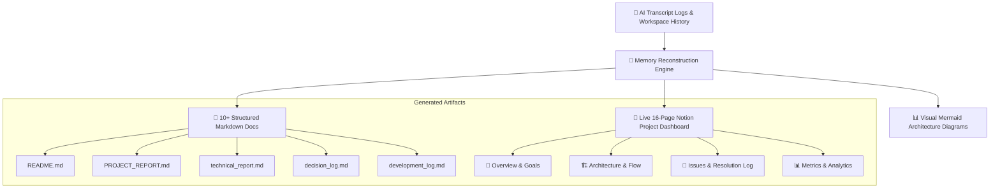

# 🚀 Antigravity Documentor (`antigravity-documentor`)

[](https://github.com)
[](https://developers.notion.com/)
[](https://github.com)
[](https://github.com)

> **Autonomous AI Project Memory Reconstruction & Documentation Engine.**  
> Turn full conversation history transcripts, code changes, decision rationales, and error logs into **10+ structured Markdown documents** and a **live 16-page Notion Project Hub** with a single command.

---

## ⚡ The Problem vs. The Solution

| The Old Way ❌ | The Antigravity Way 🚀 |
|---|---|
| Manual, tedious README updates after finishing code | **1-Click Generation** (`/document-project`) |
| Architectural decisions forgotten over time | **Automated Decision Matrix** logged with context & rationale |
| Debugging histories lost in chat scrollback | **Detailed Development Timeline** with real event timestamps |
| Fragmented docs spread across local files & wikis | **Centralized 16-Page Notion Hub** created automatically via API |

---

## 🧠 How It Works (Project Memory Reconstruction)

`antigravity-documentor` doesn't just read the current codebase state—it reconstructs the **entire development journey** from transcript logs (`transcript.jsonl`), git commits, error stack traces, and user feedback cycles.



---

## 📦 Deliverables Generated

When triggered, `antigravity-documentor` executes an 11-step pipeline that outputs:

1. **`README.md`** — Quick start, overview, and repository guide.
2. **`PROJECT_REPORT.md`** — Detailed breakdown of objectives, stack, and features.
3. **`technical_report.md`** — Formal engineering spec with algorithms, security, and performance.
4. **`development_log.md`** — Chronological timeline with exact timestamps & development phases.
5. **`decision_log.md`** — Architecture & technology decision matrix with alternatives & rationale.
6. **`visual_documentation.md`** — Architecture, sequence, component, flowchart & Gantt diagrams.
7. **`project_metrics.md`** — Estimated LOC, file breakdown, language distribution & prompt cycle metrics.
8. **`presentation_outline.md`** — 11-slide pitch deck outline with speaker notes.
9. **`reflection.md`** — Retrospective on successes, lessons learned, and future roadmap.
10. **`CHANGELOG.md`** & **`USER_GUIDE.md`** & **`DEPLOYMENT_GUIDE.md`** — Production readiness docs.
11. **🚀 16-Page Notion Workspace** — Hierarchical project hub populated via Notion MCP API.

---

## ⚡ Quick Start & Installation

### Option 1: Gemini / Antigravity Agent
Copy the skill folder into your project's `.agents/skills/` directory:
```bash
mkdir -p .agents/skills/documenting-project
cp -r SKILL.md .agents/skills/documenting-project/SKILL.md
```

### Option 2: Cursor IDE
Copy the rule into your project's `.cursor/rules/` directory:
```bash
mkdir -p .cursor/rules
cp .cursor/rules/documenting-project.mdc .cursor/rules/
```

### Option 3: Claude Code
Copy `SKILL.md` into your `.claude/skills/` directory.

---

## 🎯 Trigger Commands

Activate the skill by typing any of the following triggers in your AI assistant prompt:
- `/document-project`
- `Finalize Project`
- `Generate Project Documentation`
- `Document this project`

---

## 🔑 Notion API Integration (Optional)

To enable automatic creation of the 16-page Notion Project Hub:
1. Ensure your AI agent environment has access to the **Notion MCP Server**.
2. Set your `NOTION_API_KEY` in your environment variables (`.env`).
3. Set your Notion Parent Workspace / Database ID.

---

## 📁 Repository Structure

```text
antigravity-documentor/
├── README.md                                # You are here
├── SKILL.md                                 # Main operational SKILL specification
├── .agents/skills/documenting-project/
│   └── SKILL.md                             # Drop-in skill for Antigravity/Gemini
├── .cursor/rules/
│   └── documenting-project.mdc              # Drop-in rule for Cursor IDE
├── templates/                               # Standardized documentation templates
│   ├── PROJECT_REPORT.template.md
│   ├── technical_report.template.md
│   └── decision_log.template.md
└── examples/                                # Sample generated output showcases
    ├── sample_PROJECT_REPORT.md
    ├── sample_decision_log.md
    └── sample_project_metrics.md
```

---

## 🤝 Contributing

Contributions, feedback, and skill adaptations for new AI frameworks are welcome! Feel free to open an issue or submit a pull request.
