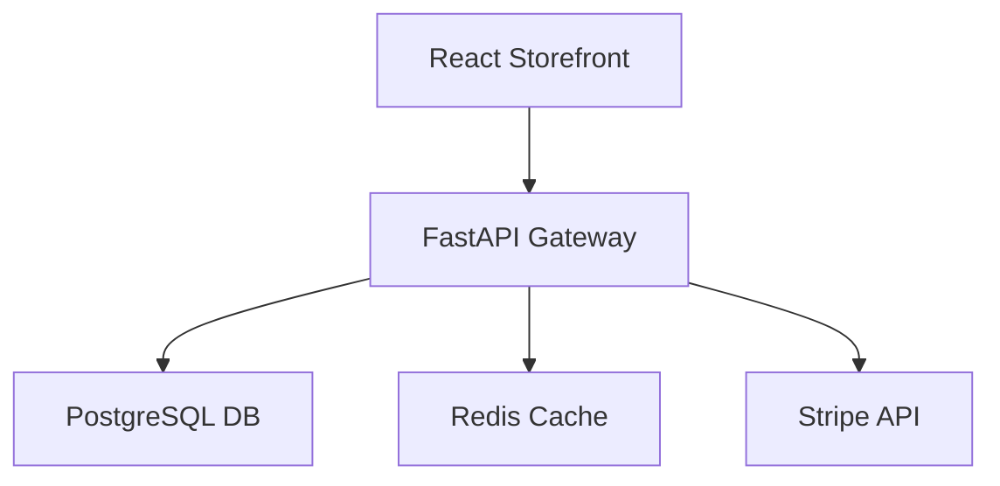

# 📁 Sample Project — E-Commerce API Service

## Overview
An automated microservice providing RESTful endpoints for inventory, order processing, and payment webhooks.

## Key Features
- JWT Authentication & RBAC middleware.
- Redis caching for product catalog requests (<5ms response time).
- Stripe payment intent integration.

## Architecture

## Metrics Summary
- **Files**: 42
- **Lines of Code**: 3,450
- **Test Coverage**: 92%
