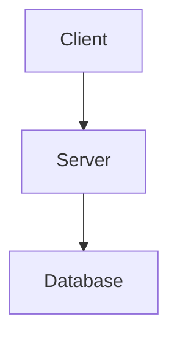

# 📁 [Project Name]

## Overview
[Brief overview of the project]

## Objective
[What problem does this project solve?]

## Problem Statement
[Detailed problem statement]

## Features
- [Feature 1]
- [Feature 2]

## Architecture


## Folder Structure
```text
project-root/
├── src/
└── docs/
```

## Technology Stack
- **Languages**: 
- **Frameworks**: 
- **Database**: 
- **Dependencies**: 
- Package A
- Package B

## Installation & Setup
```bash
# Clone & install
npm install
```

## Important Decisions
| Decision | Rationale | Impact |
|---|---|---|

## Challenges & Fixes
| Bug / Challenge | Cause | Resolution |
|---|---|---|

## Lessons Learned
- Point 1
- Point 2
